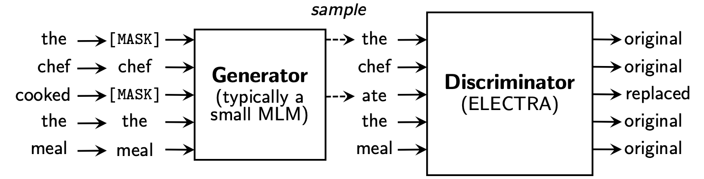

<p>
<a href="https://console.tiyaro.ai/explore?q=hfl/&pub=hfl"> </a>
</p>

[**中文说明**](./README.md) | [**English**](./README_EN.md)

<p align="center">
    <br>
    
    <br>
</p>
<p align="center">
    <a href="https://github.com/ymcui/Chinese-ELECTRA/blob/master/LICENSE">
        
    </a>
</p>
谷歌与斯坦福大学共同研发的最新预训练模型ELECTRA因其小巧的模型体积以及良好的模型性能受到了广泛关注。
为了进一步促进中文预训练模型技术的研究与发展，哈工大讯飞联合实验室基于官方ELECTRA训练代码以及大规模的中文数据训练出中文ELECTRA预训练模型供大家下载使用。
其中ELECTRA-small模型可与BERT-base甚至其他同等规模的模型相媲美，而参数量仅为BERT-base的1/10。

本项目基于谷歌&斯坦福大学官方的ELECTRA：[https://github.com/google-research/electra](https://github.com/google-research/electra)

----

[中文MacBERT](https://github.com/ymcui/MacBERT) | [中文ELECTRA](https://github.com/ymcui/Chinese-ELECTRA) | [中文XLNet](https://github.com/ymcui/Chinese-XLNet) | [知识蒸馏工具TextBrewer](https://github.com/airaria/TextBrewer) | [模型裁剪工具TextPruner](https://github.com/airaria/TextPruner)

查看更多哈工大讯飞联合实验室（HFL）发布的资源：https://github.com/ymcui/HFL-Anthology

## 新闻
**2022/3/30 我们开源了一种新预训练模型PERT。查看：https://github.com/ymcui/PERT**

2021/12/17 哈工大讯飞联合实验室推出模型裁剪工具包TextPruner。查看：https://github.com/airaria/TextPruner

2021/10/24 哈工大讯飞联合实验室发布面向少数民族语言的预训练模型CINO。查看：https://github.com/ymcui/Chinese-Minority-PLM

2021/7/21 由哈工大SCIR多位学者撰写的[《自然语言处理：基于预训练模型的方法》](https://item.jd.com/13344628.html)已出版，欢迎大家选购。

2020/12/13 基于大规模法律文书数据，我们训练了面向司法领域的中文ELECTRA系列模型，查看[模型下载](#模型下载)，[司法任务效果](#司法任务效果)。

<details>
<summary>点击这里查看历史新闻</summary>
2020/10/22 ELECTRA-180g已发布，增加了CommonCrawl的高质量数据，查看[模型下载](#模型下载)。

2020/9/15 我们的论文["Revisiting Pre-Trained Models for Chinese Natural Language Processing"](https://arxiv.org/abs/2004.13922)被[Findings of EMNLP](https://2020.emnlp.org)录用为长文。

2020/8/27 哈工大讯飞联合实验室在通用自然语言理解评测GLUE中荣登榜首，查看[GLUE榜单](https://gluebenchmark.com/leaderboard)，[新闻](http://dwz.date/ckrD)。

2020/5/29 Chinese ELECTRA-large/small-ex已发布，请查看[模型下载](#模型下载)，目前只提供Google Drive下载地址，敬请谅解。

2020/4/7 PyTorch用户可通过[🤗Transformers](https://github.com/huggingface/transformers)加载模型，查看[快速加载](#快速加载)。

2020/3/31 本目录发布的模型已接入[飞桨PaddleHub](https://github.com/PaddlePaddle/PaddleHub)，查看[快速加载](#快速加载)。

2020/3/25 Chinese ELECTRA-small/base已发布，请查看[模型下载](#模型下载)。
</details>

## 内容导引
| 章节 | 描述 |
|-|-|
| [简介](#简介) | 介绍ELECTRA基本原理 |
| [模型下载](#模型下载) | 中文ELECTRA预训练模型下载 |
| [快速加载](#快速加载) | 介绍了如何使用[🤗Transformers](https://github.com/huggingface/transformers)、[PaddleHub](https://github.com/PaddlePaddle/PaddleHub)快速加载模型 |
| [基线系统效果](#基线系统效果) | 中文基线系统效果：阅读理解、文本分类等 |
| [使用方法](#使用方法) | 模型的详细使用方法 |
| [FAQ](#FAQ) | 常见问题答疑 |
| [引用](#引用) | 本目录的技术报告 |

## 简介
**ELECTRA**提出了一套新的预训练框架，其中包括两个部分：**Generator**和**Discriminator**。

- **Generator**: 一个小的MLM，在[MASK]的位置预测原来的词。Generator将用来把输入文本做部分词的替换。
- **Discriminator**: 判断输入句子中的每个词是否被替换，即使用Replaced Token Detection (RTD)预训练任务，取代了BERT原始的Masked Language Model (MLM)。需要注意的是这里并没有使用Next Sentence Prediction (NSP)任务。

在预训练阶段结束之后，我们只使用Discriminator作为下游任务精调的基模型。

更详细的内容请查阅ELECTRA论文：[ELECTRA: Pre-training Text Encoders as Discriminators Rather Than Generators](https://openreview.net/pdf?id=r1xMH1BtvB)




## 模型下载
本目录中包含以下模型，目前仅提供TensorFlow版本权重。

* **`ELECTRA-large, Chinese`**: 24-layer, 1024-hidden, 16-heads, 324M parameters   
* **`ELECTRA-base, Chinese`**: 12-layer, 768-hidden, 12-heads, 102M parameters   
* **`ELECTRA-small-ex, Chinese`**: 24-layer, 256-hidden, 4-heads, 25M parameters
* **`ELECTRA-small, Chinese`**: 12-layer, 256-hidden, 4-heads, 12M parameters

#### 大语料版（新版，180G数据）

| 模型简称 | Google下载 | 百度网盘下载 | 压缩包大小 |
| :------- | :---------: | :---------: | :---------: |
| **`ELECTRA-180g-large, Chinese`** | [TensorFlow](https://drive.google.com/file/d/1P9yAuW0-HR7WvZ2r2weTnx3slo6f5u9q/view?usp=sharing) | [TensorFlow（密码2v5r）](https://pan.baidu.com/s/13UJIG2G0lASjjCvPmh13RQ?pwd=2v5r) | 1G |
| **`ELECTRA-180g-base, Chinese`** | [TensorFlow](https://drive.google.com/file/d/1RlmfBgyEwKVBFagafYvJgyCGuj7cTHfh/view?usp=sharing) | [TensorFlow（密码3vg1）](https://pan.baidu.com/s/15PQdeh7nRxCgXp9YmjqgsQ?pwd=3vg1) | 383M |
| **`ELECTRA-180g-small-ex, Chinese`** | [TensorFlow](https://drive.google.com/file/d/1NYJTKH1dWzrIBi86VSUK-Ml9Dsso_kuf/view?usp=sharing) | [TensorFlow（密码93n8）](https://pan.baidu.com/s/1UV83d2LNp5HHwK7X14HjPQ?pwd=93n8) | 92M |
| **`ELECTRA-180g-small, Chinese`** | [TensorFlow](https://drive.google.com/file/d/177EVNTQpH2BRW-35-0LNLjV86MuDnEmu/view?usp=sharing) | [TensorFlow（密码k9iu）](https://pan.baidu.com/s/1J5DXcehcNtX0iBXNRKLWBw?pwd=k9iu) | 46M |

#### 基础版（原版，20G数据）

| 模型简称 | Google下载 | 百度网盘下载 | 压缩包大小 |
| :------- | :---------: | :---------: | :---------: |
| **`ELECTRA-large, Chinese`** | [TensorFlow](https://drive.google.com/file/d/1ny0NMLkEWG6rseDLiF_NujdHxDcIN51m/view?usp=sharing) | [TensorFlow（密码1e14）](https://pan.baidu.com/s/1M5pSqDRbb3Vsv5r3TfviBQ?pwd=1e14) | 1G |
| **`ELECTRA-base, Chinese`** | [TensorFlow](https://drive.google.com/open?id=1FMwrs2weFST-iAuZH3umMa6YZVeIP8wD) | [TensorFlow（密码f32j）](https://pan.baidu.com/s/1HOzCBNaoIEULj_s-q3dDzA?pwd=f32j) | 383M |
| **`ELECTRA-small-ex, Chinese`** | [TensorFlow](https://drive.google.com/file/d/1LluPORc7xtFmCTFR4IF17q77ip82i7__/view?usp=sharing) | [TensorFlow（密码gfb1）](https://pan.baidu.com/s/1dOLw4feMJcsgZL07V-koWA?pwd=gfb1) | 92M |
| **`ELECTRA-small, Chinese`** | [TensorFlow](https://drive.google.com/open?id=1uab-9T1kR9HgD2NB0Kz1JB_TdSKgJIds) | [TensorFlow（密码1r4r）](https://pan.baidu.com/s/1UIosBYOHVA3bDuJrFqU0NQ?pwd=1r4r) | 46M |

#### 司法领域版（new）

| 模型简称 | Google下载 | 百度网盘下载 | 压缩包大小 |
| :------- | :---------: | :---------: | :---------: |
| **`legal-ELECTRA-large, Chinese`** | [TensorFlow](https://drive.google.com/file/d/1jPyVi_t4QmTkFy7PD-m-hG-lQ8cIETzD/view?usp=sharing) | [TensorFlow（密码q4gv）](https://pan.baidu.com/s/180cloQ0A3m3VqpLPeKpPYg?pwd=q4gv) | 1G |
| **`legal-ELECTRA-base, Chinese`** | [TensorFlow](https://drive.google.com/file/d/12ZLaoFgpqGJxSi_9KiQV-jdVN4XRGMiD/view?usp=sharing) | [TensorFlow（密码8gcv）](https://pan.baidu.com/s/1OWwSsr-jCWq3vb7Js4B2vg?pwd=8gcv) | 383M |
| **`legal-ELECTRA-small, Chinese`** | [TensorFlow](https://drive.google.com/file/d/1arQ5qNTNoc1OyMH8wBUKdTMy2QponIFY/view?usp=sharing) | [TensorFlow（密码kmrj）](https://pan.baidu.com/s/1FIblX4EU23KSQWft3DWL0g?pwd=kmrj) | 46M |


### PyTorch/TF2版本

如需PyTorch版本，请自行通过🤗Transformers提供的转换脚本[convert_electra_original_tf_checkpoint_to_pytorch.py](https://github.com/huggingface/transformers/blob/master/src/transformers/convert_electra_original_tf_checkpoint_to_pytorch.py)进行转换。如需配置文件可进入到本目录下的config文件夹中查找。

```bash
python transformers/src/transformers/convert_electra_original_tf_checkpoint_to_pytorch.py \
--tf_checkpoint_path ./path-to-large-model/ \
--config_file ./path-to-large-model/discriminator.json \
--pytorch_dump_path ./path-to-output/model.bin \
--discriminator_or_generator discriminator
```

或者通过huggingface官网直接下载PyTorch版权重：https://huggingface.co/hfl

方法：点击任意需要下载的model → 拉到最下方点击"List all files in model" → 在弹出的小框中下载bin和json文件。

### 使用须知

中国大陆境内建议使用百度网盘下载点，境外用户建议使用谷歌下载点。 
以TensorFlow版`ELECTRA-small, Chinese`为例，下载完毕后对zip文件进行解压得到如下文件。

```
chinese_electra_small_L-12_H-256_A-4.zip
    |- electra_small.data-00000-of-00001    # 模型权重
    |- electra_small.meta                   # 模型meta信息
    |- electra_small.index                  # 模型index信息
    |- vocab.txt                            # 词表
    |- discriminator.json                   # 配置文件：discriminator（若没有可从本repo中的config目录获取）
    |- generator.json                       # 配置文件：generator（若没有可从本repo中的config目录获取）
```

### 训练细节

我们采用了大规模中文维基以及通用文本训练了ELECTRA模型，总token数达到5.4B，与[RoBERTa-wwm-ext系列模型](https://github.com/ymcui/Chinese-BERT-wwm)一致。词表方面沿用了谷歌原版BERT的WordPiece词表，包含21,128个token。其他细节和超参数如下（未提及的参数保持默认）：
- `ELECTRA-large`: 24层，隐层1024，16个注意力头，学习率1e-4，batch96，最大长度512，训练2M步
- `ELECTRA-base`: 12层，隐层768，12个注意力头，学习率2e-4，batch256，最大长度512，训练1M步
- `ELECTRA-small-ex`: 24层，隐层256，4个注意力头，学习率5e-4，batch384，最大长度512，训练2M步
- `ELECTRA-small`: 12层，隐层256，4个注意力头，学习率5e-4，batch1024，最大长度512，训练1M步


## 快速加载
### 使用Huggingface-Transformers

[Huggingface-Transformers 2.8.0](https://github.com/huggingface/transformers/releases/tag/v2.8.0)版本已正式支持ELECTRA模型，可通过如下命令调用。
```python
tokenizer = AutoTokenizer.from_pretrained(MODEL_NAME)
model = AutoModel.from_pretrained(MODEL_NAME) 
```

其中`MODEL_NAME`对应列表如下：

| 模型名 | 组件 | MODEL_NAME |
| - | - | - |
| ELECTRA-180g-large, Chinese | discriminator | hfl/chinese-electra-180g-large-discriminator |
| ELECTRA-180g-large, Chinese | generator | hfl/chinese-electra-180g-large-generator |
| ELECTRA-180g-base, Chinese | discriminator | hfl/chinese-electra-180g-base-discriminator |
| ELECTRA-180g-base, Chinese | generator | hfl/chinese-electra-180g-base-generator |
| ELECTRA-180g-small-ex, Chinese | discriminator | hfl/chinese-electra-180g-small-ex-discriminator |
| ELECTRA-180g-small-ex, Chinese | generator | hfl/chinese-electra-180g-small-ex-generator |
| ELECTRA-180g-small, Chinese | discriminator | hfl/chinese-electra-180g-small-discriminator |
| ELECTRA-180g-small, Chinese | generator | hfl/chinese-electra-180g-small-generator |
| ELECTRA-large, Chinese | discriminator | hfl/chinese-electra-large-discriminator |
| ELECTRA-large, Chinese | generator | hfl/chinese-electra-large-generator |
| ELECTRA-base, Chinese | discriminator | hfl/chinese-electra-base-discriminator |
| ELECTRA-base, Chinese | generator | hfl/chinese-electra-base-generator |
| ELECTRA-small-ex, Chinese | discriminator | hfl/chinese-electra-small-ex-discriminator |
| ELECTRA-small-ex, Chinese | generator | hfl/chinese-electra-small-ex-generator |
| ELECTRA-small, Chinese | discriminator | hfl/chinese-electra-small-discriminator |
| ELECTRA-small, Chinese | generator | hfl/chinese-electra-small-generator |

司法领域版本：

| 模型名 | 组件 | MODEL_NAME |
| - | - | - |
| legal-ELECTRA-large, Chinese | discriminator | hfl/chinese-legal-electra-large-discriminator |
| legal-ELECTRA-large, Chinese | generator | hfl/chinese-legal-electra-large-generator |
| legal-ELECTRA-base, Chinese | discriminator | hfl/chinese-legal-electra-base-discriminator |
| legal-ELECTRA-base, Chinese | generator | hfl/chinese-legal-electra-base-generator |å
| legal-ELECTRA-small, Chinese | discriminator | hfl/chinese-legal-electra-small-discriminator |
| legal-ELECTRA-small, Chinese | generator | hfl/chinese-legal-electra-small-generator |


### 使用PaddleHub
依托[PaddleHub](https://github.com/PaddlePaddle/PaddleHub)，我们只需一行代码即可完成模型下载安装，十余行代码即可完成文本分类、序列标注、阅读理解等任务。

```
import paddlehub as hub
module = hub.Module(name=MODULE_NAME)
```

其中`MODULE_NAME`对应列表如下：

| 模型名 | MODULE_NAME |
| - | - |
| ELECTRA-base, Chinese | [chinese-electra-base](https://paddlepaddle.org.cn/hubdetail?name=chinese-electra-base&en_category=SemanticModel) |
| ELECTRA-small, Chinese  | [chinese-electra-small](https://paddlepaddle.org.cn/hubdetail?name=chinese-electra-small&en_category=SemanticModel) |


## 基线系统效果
我们将`ELECTRA-small/base`与[`BERT-base`](https://github.com/google-research/bert)、[`BERT-wwm`、`BERT-wwm-ext`、`RoBERTa-wwm-ext`、`RBT3`](https://github.com/ymcui/Chinese-BERT-wwm)进行了效果对比，包括以下六个任务：  
- [**CMRC 2018 (Cui et al., 2019)**：篇章片段抽取型阅读理解（简体中文）](https://github.com/ymcui/cmrc2018)
- [**DRCD (Shao et al., 2018)**：篇章片段抽取型阅读理解（繁体中文）](https://github.com/DRCSolutionService/DRCD)
- [**XNLI (Conneau et al., 2018)**：自然语言推断](https://github.com/google-research/bert/blob/master/multilingual.md)
- [**ChnSentiCorp**：情感分析](https://github.com/pengming617/bert_classification)
- [**LCQMC (Liu et al., 2018)**：句对匹配](http://icrc.hitsz.edu.cn/info/1037/1146.htm)
- [**BQ Corpus (Chen et al., 2018)**：句对匹配](http://icrc.hitsz.edu.cn/Article/show/175.html)

对于ELECTRA-small/base模型，我们使用原论文默认的`3e-4`和`1e-4`的学习率。
**需要注意的是，我们没有针对任何任务进行参数精调，所以通过调整学习率等超参数可能获得进一步性能提升。**
为了保证结果的可靠性，对于同一模型，我们使用不同随机种子训练10遍，汇报模型性能的最大值和平均值（括号内为平均值）。


### 简体中文阅读理解：CMRC 2018
[**CMRC 2018数据集**](https://github.com/ymcui/cmrc2018)是哈工大讯飞联合实验室发布的中文机器阅读理解数据。
根据给定问题，系统需要从篇章中抽取出片段作为答案，形式与[SQuAD](http://arxiv.org/abs/1606.05250)相同。
评价指标为：EM / F1

| 模型 | 开发集 | 测试集 | 挑战集 | 参数量 |
| :------- | :---------: | :---------: | :---------: | :---------: |
| BERT-base | 65.5 (64.4) / 84.5 (84.0) | 70.0 (68.7) / 87.0 (86.3) | 18.6 (17.0) / 43.3 (41.3) | 102M |
| BERT-wwm | 66.3 (65.0) / 85.6 (84.7) | 70.5 (69.1) / 87.4 (86.7) | 21.0 (19.3) / 47.0 (43.9) | 102M |
| BERT-wwm-ext | 67.1 (65.6) / 85.7 (85.0) | 71.4 (70.0) / 87.7 (87.0) | 24.0 (20.0) / 47.3 (44.6) | 102M |
| RoBERTa-wwm-ext | 67.4 (66.5) / 87.2 (86.5) | 72.6 (71.4) / 89.4 (88.8) | 26.2 (24.6) / 51.0 (49.1) | 102M |
| RBT3 | 57.0 / 79.0 | 62.2 / 81.8 | 14.7 / 36.2 | 38M |
| **ELECTRA-small** | 63.4 (62.9) / 80.8 (80.2) | 67.8 (67.4) / 83.4 (83.0) | 16.3 (15.4) / 37.2 (35.8) | 12M |
| **ELECTRA-180g-small** | 63.8 / 82.7 | 68.5 / 85.2 | 15.1 / 35.8 | 12M |
| **ELECTRA-small-ex** | 66.4 / 82.2 | 71.3 / 85.3 | 18.1 / 38.3 | 25M |
| **ELECTRA-180g-small-ex** | 68.1 / 85.1 | 71.8 / 87.2 | 20.6 / 41.7 | 25M |
| **ELECTRA-base** | 68.4 (68.0) / 84.8 (84.6) | 73.1 (72.7) / 87.1 (86.9) | 22.6 (21.7) / 45.0 (43.8) | 102M |
| **ELECTRA-180g-base** | 69.3 / 87.0 | 73.1 / 88.6 | 24.0 / 48.6 | 102M |
| **ELECTRA-large** | 69.1 / 85.2 | 73.9 / 87.1 | 23.0 / 44.2 | 324M |
| **ELECTRA-180g-large** | 68.5 / 86.2 | 73.5 / 88.5 | 21.8 / 42.9 | 324M |


### 繁体中文阅读理解：DRCD
[**DRCD数据集**](https://github.com/DRCKnowledgeTeam/DRCD)由中国台湾台达研究院发布，其形式与SQuAD相同，是基于繁体中文的抽取式阅读理解数据集。
评价指标为：EM / F1

| 模型 | 开发集 | 测试集 | 参数量 |
| :------- | :---------: | :---------: | :---------: |
| BERT-base | 83.1 (82.7) / 89.9 (89.6) | 82.2 (81.6) / 89.2 (88.8) | 102M |
| BERT-wwm | 84.3 (83.4) / 90.5 (90.2) | 82.8 (81.8) / 89.7 (89.0) | 102M |
| BERT-wwm-ext | 85.0 (84.5) / 91.2 (90.9) | 83.6 (83.0) / 90.4 (89.9) | 102M |
| RoBERTa-wwm-ext | 86.6 (85.9) / 92.5 (92.2) | 85.6 (85.2) / 92.0 (91.7) | 102M |
| RBT3 | 76.3 / 84.9 | 75.0 / 83.9 | 38M |
| **ELECTRA-small** | 79.8 (79.4) / 86.7 (86.4) | 79.0 (78.5) / 85.8 (85.6) | 12M |
| **ELECTRA-180g-small** | 83.5 / 89.2 | 82.9 / 88.7 | 12M |
| **ELECTRA-small-ex** | 84.0 / 89.5 | 83.3 / 89.1 | 25M |
| **ELECTRA-180g-small-ex** | 87.3 / 92.3 | 86.5 / 91.3 | 25M |
| **ELECTRA-base** | 87.5 (87.0) / 92.5 (92.3) | 86.9 (86.6) / 91.8 (91.7) | 102M |
| **ELECTRA-180g-base** | 89.6 / 94.2 | 88.9 / 93.7 | 102M |
| **ELECTRA-large** | 88.8 / 93.3 | 88.8 / 93.6 | 324M |
| **ELECTRA-180g-large** | 90.1 / 94.8 | 90.5 / 94.7 | 324M |

### 自然语言推断：XNLI
在自然语言推断任务中，我们采用了[**XNLI**数据](https://github.com/google-research/bert/blob/master/multilingual.md)，需要将文本分成三个类别：`entailment`，`neutral`，`contradictory`。
评价指标为：Accuracy

| 模型 | 开发集 | 测试集 | 参数量 |
| :------- | :---------: | :---------: | :---------: |
| BERT-base | 77.8 (77.4) | 77.8 (77.5) | 102M |
| BERT-wwm | 79.0 (78.4) | 78.2 (78.0) | 102M |
| BERT-wwm-ext | 79.4 (78.6) | 78.7 (78.3) | 102M |
| RoBERTa-wwm-ext | 80.0 (79.2) | 78.8 (78.3) | 102M |
| RBT3 | 72.2 | 72.3 | 38M |
| **ELECTRA-small** | 73.3 (72.5) | 73.1 (72.6) | 12M |
| **ELECTRA-180g-small** | 74.6 | 74.6 | 12M |
| **ELECTRA-small-ex** | 75.4 | 75.8 | 25M |
| **ELECTRA-180g-small-ex** | 76.5 | 76.6 | 25M |
| **ELECTRA-base** | 77.9 (77.0) | 78.4 (77.8) | 102M |
| **ELECTRA-180g-base** | 79.6 | 79.5 | 102M |
| **ELECTRA-large** | 81.5 | 81.0 | 324M |
| **ELECTRA-180g-large** | 81.2 | 80.4 | 324M |

### 情感分析：ChnSentiCorp
在情感分析任务中，二分类的情感分类数据集[**ChnSentiCorp**](https://github.com/pengming617/bert_classification)。
评价指标为：Accuracy

| 模型 | 开发集 | 测试集 | 参数量 |
| :------- | :---------: | :---------: | :---------: |
| BERT-base | 94.7 (94.3) | 95.0 (94.7) | 102M |
| BERT-wwm | 95.1 (94.5) | 95.4 (95.0) | 102M |
| BERT-wwm-ext | 95.4 (94.6) | 95.3 (94.7) | 102M |
| RoBERTa-wwm-ext | 95.0 (94.6) | 95.6 (94.8) | 102M |
| RBT3 | 92.8 | 92.8 | 38M |
| **ELECTRA-small** | 92.8 (92.5) | 94.3 (93.5) | 12M |
| **ELECTRA-180g-small** | 94.1 | 93.6 | 12M |
| **ELECTRA-small-ex** | 92.6 | 93.6 | 25M |
| **ELECTRA-180g-small-ex** | 92.8 | 93.4 | 25M |
| **ELECTRA-base** | 93.8 (93.0) | 94.5 (93.5) | 102M |
| **ELECTRA-180g-base** | 94.3 | 94.8 | 102M |
| **ELECTRA-large** | 95.2 | 95.3 | 324M |
| **ELECTRA-180g-large** | 94.8 | 95.2 | 324M |

### 句对分类：LCQMC
以下两个数据集均需要将一个句对进行分类，判断两个句子的语义是否相同（二分类任务）。

[**LCQMC**](http://icrc.hitsz.edu.cn/info/1037/1146.htm)由哈工大深圳研究生院智能计算研究中心发布。 
评价指标为：Accuracy

| 模型 | 开发集 | 测试集 | 参数量 |
| :------- | :---------: | :---------: | :---------: |
| BERT | 89.4 (88.4) | 86.9 (86.4) | 102M |
| BERT-wwm | 89.4 (89.2) | 87.0 (86.8) | 102M |
| BERT-wwm-ext | 89.6 (89.2) | 87.1 (86.6) | 102M |
| RoBERTa-wwm-ext | 89.0 (88.7) | 86.4 (86.1) | 102M |
| RBT3 | 85.3 | 85.1 | 38M |
| **ELECTRA-small** | 86.7 (86.3) | 85.9 (85.6) | 12M |
| **ELECTRA-180g-small** | 86.6 | 85.8 | 12M |
| **ELECTRA-small-ex** | 87.5 | 86.0 | 25M |
| **ELECTRA-180g-small-ex** | 87.6 | 86.3 | 25M |
| **ELECTRA-base** | 90.2 (89.8) | 87.6 (87.3) | 102M |
| **ELECTRA-180g-base** | 90.2 | 87.1 | 102M |
| **ELECTRA-large** | 90.7 | 87.3 | 324M |
| **ELECTRA-180g-large** | 90.3 | 87.3 | 324M |


### 句对分类：BQ Corpus 
[**BQ Corpus**](http://icrc.hitsz.edu.cn/Article/show/175.html)由哈工大深圳研究生院智能计算研究中心发布，是面向银行领域的数据集。
评价指标为：Accuracy

| 模型 | 开发集 | 测试集 | 参数量 |
| :------- | :---------: | :---------: | :---------: |
| BERT | 86.0 (85.5) | 84.8 (84.6) | 102M |
| BERT-wwm | 86.1 (85.6) | 85.2 (84.9) | 102M |
| BERT-wwm-ext | 86.4 (85.5) | 85.3 (84.8) | 102M |
| RoBERTa-wwm-ext | 86.0 (85.4) | 85.0 (84.6) | 102M |
| RBT3 | 84.1 | 83.3 | 38M |
| **ELECTRA-small** | 83.5 (83.0) | 82.0 (81.7) | 12M |
| **ELECTRA-180g-small** | 83.3 | 82.1 | 12M |
| **ELECTRA-small-ex** | 84.0 | 82.6 | 25M |
| **ELECTRA-180g-small-ex** | 84.6 | 83.4 | 25M |
| **ELECTRA-base** | 84.8 (84.7) | 84.5 (84.0) | 102M |
| **ELECTRA-180g-base** | 85.8 | 84.5 | 102M |
| **ELECTRA-large** | 86.7 | 85.1 | 324M |
| **ELECTRA-180g-large** | 86.4 | 85.4 | 324M |


### 司法任务效果
我们使用CAIL 2018司法评测的[罪名预测数据](https://github.com/liuhuanyong/CrimeKgAssitant)对司法ELECTRA进行了测试。small/base/large学习率分别为：5e-4/3e-4/1e-4。
评价指标为：Accuracy

| 模型 | 开发集 | 测试集 | 参数量 |
| :------- | :---------: | :---------: | :---------: |
| ELECTRA-small | 78.84 | 76.35 | 12M |
| **legal-ELECTRA-small** | **79.60** | **77.03** | 12M |
| ELECTRA-base | 80.94 | 78.41 | 102M |
| **legal-ELECTRA-base** | **81.71** | **79.17** | 102M |
| ELECTRA-large | 81.53 | 78.97 | 324M |
| **legal-ELECTRA-large** | **82.60** | **79.89** | 324M |


## 使用方法
用户可以基于已发布的上述中文ELECTRA预训练模型进行下游任务精调。
在这里我们只介绍最基本的用法，更详细的用法请参考[ELECTRA官方介绍](https://github.com/google-research/electra)。

本例中，我们使用`ELECTRA-small`模型在CMRC 2018任务上进行精调，相关步骤如下。假设，  
- `data-dir`：工作根目录，可按实际情况设置。
- `model-name`：模型名称，本例中为`electra-small`。
- `task-name`：任务名称，本例中为`cmrc2018`。本目录中的代码已适配了以上六个中文任务，`task-name`分别为`cmrc2018`，`drcd`，`xnli`，`chnsenticorp`，`lcqmc`，`bqcorpus`。

### 第一步：下载预训练模型并解压
在[模型下载](#模型下载)章节中，下载ELECTRA-small模型，并解压至`${data-dir}/models/${model-name}`。
该目录下应包含`electra_model.*`，`vocab.txt`，`checkpoint`，共计5个文件。

### 第二步：准备任务数据
下载[CMRC 2018训练集和开发集](https://github.com/ymcui/cmrc2018/tree/master/squad-style-data)，并重命名为`train.json`和`dev.json`。
将两个文件放到`${data-dir}/finetuning_data/${task-name}`。

### 第三步：运行训练命令
```shell
python run_finetuning.py \
    --data-dir ${data-dir} \
    --model-name ${model-name} \
    --hparams params_cmrc2018.json
```
其中`data-dir`和`model-name`在上面已经介绍。`hparams`是一个JSON词典，在本例中的`params_cmrc2018.json`包含了精调相关超参数，例如：
```json
{
    "task_names": ["cmrc2018"],
    "max_seq_length": 512,
    "vocab_size": 21128,
    "model_size": "small",
    "do_train": true,
    "do_eval": true,
    "write_test_outputs": true,
    "num_train_epochs": 2,
    "learning_rate": 3e-4,
    "train_batch_size": 32,
    "eval_batch_size": 32,
}
```
在上述JSON文件中，我们只列举了最重要的一些参数，完整参数列表请查阅[configure_finetuning.py](./configure_finetuning.py)。

运行完毕后，  
1. 对于阅读理解任务，生成的预测JSON数据`cmrc2018_dev_preds.json`保存在`${data-dir}/results/${task-name}_qa/`。可以调用外部评测脚本来得到最终评测结果，例如：`python cmrc2018_drcd_evaluate.py dev.json cmrc2018_dev_preds.json`
2. 对于分类任务，相关accuracy信息会直接打印在屏幕，例如：`xnli: accuracy: 72.5 - loss: 0.67`


## FAQ
**Q: 在下游任务精调的时候ELECTRA模型的学习率怎么设置？**  
A: 我们建议使用原论文使用的学习率作为初始基线（small是3e-4，base是1e-4）然后适当增减学习率进行调试。
需要注意的是，相比BERT、RoBERTa一类的模型来说ELECTRA的学习率要相对大一些。

**Q: 有没有PyTorch版权重？**  
A: 有，[模型下载](#模型下载)。

**Q: 预训练用的数据能共享一下吗？**  
A: 很遗憾，不可以。

**Q: 未来计划？**  
A: 敬请关注。

## 引用
如果本目录中的内容对你的研究工作有所帮助，欢迎在论文中引用下述论文。
- 首选：https://ieeexplore.ieee.org/document/9599397
```
@journal{cui-etal-2021-pretrain,
  title={Pre-Training with Whole Word Masking for Chinese BERT},
  author={Cui, Yiming and Che, Wanxiang and Liu, Ting and Qin, Bing and Yang, Ziqing},
  journal={IEEE Transactions on Audio, Speech and Language Processing},
  year={2021},
  url={https://ieeexplore.ieee.org/document/9599397},
  doi={10.1109/TASLP.2021.3124365},
 }
```

- 或者：https://www.aclweb.org/anthology/2020.findings-emnlp.58
```
@inproceedings{cui-etal-2020-revisiting,
    title = "Revisiting Pre-Trained Models for {C}hinese Natural Language Processing",
    author = "Cui, Yiming  and
      Che, Wanxiang  and
      Liu, Ting  and
      Qin, Bing  and
      Wang, Shijin  and
      Hu, Guoping",
    booktitle = "Proceedings of the 2020 Conference on Empirical Methods in Natural Language Processing: Findings",
    month = nov,
    year = "2020",
    address = "Online",
    publisher = "Association for Computational Linguistics",
    url = "https://www.aclweb.org/anthology/2020.findings-emnlp.58",
    pages = "657--668",
}
```


## 关注我们
欢迎关注**哈工大讯飞联合实验室**官方微信公众号，了解最新的技术动态。


## 问题反馈
Before you submit an issue:

- **You are advised to read [FAQ](https://github.com/ymcui/MacBERT#FAQ) first before you submit an issue.**
- Repetitive and irrelevant issues will be ignored and closed by [stable-bot](stale · GitHub Marketplace). Thank you for your understanding and support.
- We cannot acommodate EVERY request, and thus please bare in mind that there is no guarantee that your request will be met.
- Always be polite when you submit an issue.